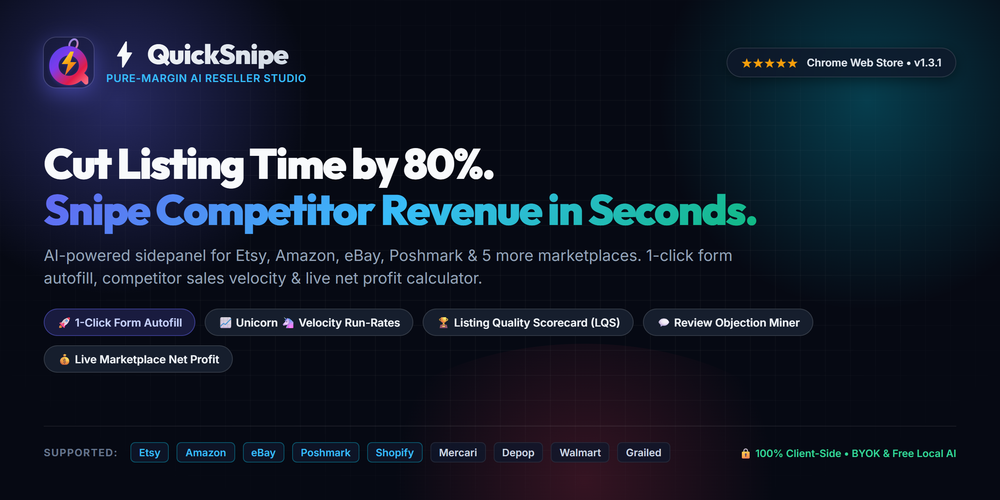

  

# ⚡ QuickSnipe

### Pure-Margin AI Listing Studio, Competitor Sales Velocity & Profit Sniper for Google Chrome

  <a href="https://radtome.github.io/QuickSnipe-support/"><b>🌐 Official Website & Live Demos</b></a> •
  <a href="https://chromewebstore.google.com/detail/quicksnipe-ai-listing-res/aignalgmmlmnmofabamcdngdopabgkaa"><b>🛒 Chrome Web Store</b></a> •
  <a href="#-quick-navigation"><b>⚡ Navigation</b></a> •
  <a href="TROUBLESHOOTING.md"><b>🛠️ Troubleshooting</b></a> •
  <a href="FAQ.md"><b>❓ FAQs</b></a> •
  <a href="PRIVACY.md"><b>🛡️ Privacy Policy</b></a> •
  <a href="SUPPORT.md"><b>🆘 Support Policy</b></a> •
  <a href="https://github.com/RadTome/QuickSnipe-support/issues/new/choose"><b>🐛 Open Issue</b></a>

---

## ⚡ Quick Navigation

| Resource | Description | Link |
|---|---|---|
| 🌐 **Interactive Portal & Live Sandboxes** | Official website with live fee simulator, LQS title grader, and BYOK setup | [radtome.github.io/QuickSnipe-support](https://radtome.github.io/QuickSnipe-support/) |
| 📋 **Release Notes & Roadmap** | Full changelog for v1.3.2 (Live) and v1.3.3 (Upcoming) | [CHANGELOG.md](CHANGELOG.md) |
| 📖 **Support Policy & Channels** | How to get support, SLA, and response guidelines | [SUPPORT.md](SUPPORT.md) |
| 🛡️ **Privacy Policy** | 100% client-side data handling, permissions & Web Store compliance | [PRIVACY.md](PRIVACY.md) |
| 🛠️ **Troubleshooting Guide** | Step-by-step diagnostics for scraping, API keys, and autofill | [TROUBLESHOOTING.md](TROUBLESHOOTING.md) |
| ❓ **Frequently Asked Questions** | Common seller questions, safety, bans, and licensing | [FAQ.md](FAQ.md) |
| 🔒 **Security & Disclosures** | Security vulnerability reporting and private advisories | [SECURITY.md](SECURITY.md) |
| 🐛 **Open a Bug Report** | Report broken scrapers, UI glitches, or extension errors | [Submit Bug](https://github.com/RadTome/QuickSnipe-support/issues/new?template=1_bug_report.yml) |
| 💡 **Request a Feature** | Request a new marketplace, AI model, or studio generator | [Submit Feature](https://github.com/RadTome/QuickSnipe-support/issues/new?template=2_feature_request.yml) |
| 💬 **Community Discussions** | Strategy, prompt sharing, and seller workflows | [GitHub Discussions](https://github.com/RadTome/QuickSnipe-support/discussions) |

---

## 🚀 Release Status: v1.3.2 (Live) · v1.3.3 (Upcoming)

### 🟢 Current Stable: QuickSnipe v1.3.2 (Published on Chrome Web Store)
QuickSnipe **v1.3.2** is the current production version live on the [Chrome Web Store](https://chromewebstore.google.com/detail/quicksnipe-ai-listing-res/aignalgmmlmnmofabamcdngdopabgkaa). Install or update directly from the store.

**Core capabilities in v1.3.2:**
- **🛡️ Least-Privilege Security Hardening**: Purged broad wildcard host permissions (`http://*/*`, `https://*/*`) and unneeded `tabs` permission. Active tab inspection strictly via focused `activeTab`.
- **🌓 WCAG AAA High-Contrast Light Glass Theme**: High-contrast typography (`#0f172a` / `#334155`) across notice banners, AI model tier tags, and modal dialogs.
- **⚡ Session Continuity & UI State Preservation**: Reopening sidepanel instantly restores active competitor analyses, search queries, mined review results, and profit calculations without losing progress.
- **♿ W3C APG Accessibility**: Accessible roving focus, focus trapping in modal dialogs, and instant `Escape` dismissal.

### 🔮 Upcoming Release: QuickSnipe v1.3.3 (Staged / In Review)
QuickSnipe **v1.3.3** is finalized and currently in review for the Chrome Web Store.

**What is coming in v1.3.3:**
- **💰 Pure-Value Pricing Stack**: Introduced $7.99/mo, $49/yr, and $69 one-time lifetime tiers, undercutting legacy tools by 60%+ with zero server token markup.
- **💎 Pro Experience Polish**: All promotional banners, upgrade buttons, and daily usage meters are cleanly hidden once Pro is active.
- **⚡ Lightweight Popup Boot**: Extracted minimal site detector `utils/detect-site.js` (~500B) replacing 143KB parser bundle in popup context, reducing popup load time by ~200ms.
- **🔄 Service Worker Keepalive & AI Timeout**: Keepalive connection prevents idle termination during long LLM calls, coupled with a 90-second client-side timeout wrapper.
- **🛡️ Hardened QuickBar XSS Prevention**: Eliminated `innerHTML` in in-page notifications in favor of safe DOM construction and `textContent`.
- **♿ APG Accessibility Upgrades**: Added `tabindex="0"` to all tab panels, `aria-live="polite"` to dynamic result containers, and full progressbar attributes in popup.
- **🎨 3-Way Theme Cycling**: Quick toggle now cycles smoothly through Dark, Light Glass, and System Auto with high-contrast light mode styling.
- **⌨️ Conflict-Free Hotkey**: Changed swipe capture hotkey to `Alt+Shift+S` to prevent collisions with browser "Save As".
- **⚡ Complete Session State Continuity**: Reopening the sidepanel automatically restores competitor analyses, custom queries, mined reviews, and profit calculations without data loss.
- **🎯 Direct Studio Tool Routing**: Creator dashboard quick-action cards route straight into the corresponding studio tool upon launch.
- **🔒 Strict Host Storage Sandboxing**: In-page QuickBar positions and snooze preferences save strictly to isolated `chrome.storage.local`, leaving zero footprint on merchant sites.
- **✍️ Form Autofill Focus Preservation**: 1-Click Fast Fill retains active field focus and cursor position after injection.
- **♿ W3C APG Accessibility**: Roving `tabindex` arrow-key tab switching, accessible modal dialog focus trapping, and `Escape` key dismissal.
- **🪟 Pointer-Capture Dragging**: Shadow DOM event boundary and pointer capture prevent mouse-drop issues over iframes.
- **📱 320px–360px Narrow Viewport Support**: Header overflow collapse and smooth scroll-snap tab navigation.
- **🔄 Tab Connection Recovery**: Proactive prompts guide sellers to reload tabs after background service worker updates.
- **📋 Local Offline Feedback**: Instant local recording with 1-click clipboard export and GitHub Discussions bridging.

### 📦 Previous Major Milestone: v1.3.1
- **🤖 On-Device AI with Chrome Built-in AI**: Zero-key, 100% private local listing generation via Gemini Nano (Chrome 131+ Prompt API).
- **🔑 Expanded BYOK Models**: Instant access to Google Gemini 3.6/2.0 Flash, Groq Llama 3.3 70B, Claude 3.7 Sonnet, OpenAI GPT-4o, DeepSeek V3/R1, OpenRouter, and offline Ollama.
- **🛒 Walmart & Grailed Integration**: Dedicated scrapers, AI generators, and fee calculator presets for Walmart Marketplace and Grailed Luxury Archive.
- **📈 Competitor Sales Velocity & Revenue Sniper**: Monthly unit volume and gross revenue run-rates with Unicorn 🦄, Fast Mover 🔥, Steady ⚡, and Emerging 🌱 badges.
- **🏆 Listing Quality Scorecard (LQS)**: Instant Grade S to F audits with 1-click missing attribute fixes.
- **⚡ 1-Click Form Autofill & QuickBar HUD**: Native React/Vue-compatible form population on Etsy, Amazon, eBay, Shopify, Poshmark, and Depop.
- **📦 Amazon 249B Search Term Validator**: Strict UTF-8 byte boundary enforcement with automated stop word cleaner.

👉 *For complete version history and detailed change logs, see [CHANGELOG.md](CHANGELOG.md).*

---

## 📖 What is QuickSnipe?

**QuickSnipe** is a high-performance **Google Chrome Sidepanel Extension (Manifest V3)** built specifically for multi-channel e-commerce sellers across **Etsy, Amazon, eBay, Shopify, Poshmark, Depop, Mercari, Walmart, and Grailed**.

Instead of paying $20–$99/month for multiple bloated SaaS tools that store your seller data on third-party servers, QuickSnipe runs **100% locally in your browser** with zero cloud server overhead, zero subscription lock-in, and zero latency.

---

## 💎 Core Feature Breakdown

| 🤖 AI Studio | 📈 Sales Velocity & Sniper | 💬 Reviews | 🏆 Quality & SEO | 🔧 Tools & QuickBar |
|:---:|:---:|:---:|:---:|:---:|
| **10+ AI Generators** Etsy, Amazon, eBay, Shopify, Poshmark, Depop, Mercari, Walmart, Grailed | **Revenue & Velocity Sniper** Monthly unit sales, revenue run-rates & velocity tiers | **Review Miner** Scrapes 1–3 star complaints on competitor items | **Listing Quality Scorecard (LQS)** Grade S to F audits with instant 1-click fixes | **Profit Calculator** Live fees, margins, ROI & breakeven prices |
| **Omnichannel Transmuter** Generates platform-tailored packs in 1 pass | **Price Sweet-Spot** Median, Min, Max & price distribution curves | **Objection Slayer** Converts buyer objections into FAQs | **Trademark Pre-Flight Guard** Flags IP risks and protected brand names | **In-Page QuickBar** Floating 1-click form autofill HUD |
| **On-Device / BYOK** Chrome Built-in AI or Gemini, Groq, OpenAI, Claude | **Keyword Gap Matrix** Venn analysis vs top 24 ranking competitors | **Social & Ads Kit** Instagram, TikTok, Pinterest & paid search copy | **Readability & Meta Audit** Flesch-Kincaid grade & image alt-tags | **Amazon 249B Validator** Strict UTF-8 byte meter & stop word cleaner |

### 1. ⚡ 1-Click Form Autofill Engine & In-Page QuickBar
Push AI-generated Title, Price, Description, and Tags directly into active listing creation and edit forms on **Etsy Shop Manager, Amazon Seller Central, eBay Selling, Shopify Admin, Poshmark, and Depop**.
- **Floating QuickBar HUD**: In-page quick-action assistant for rapid form mapping without switching windows. Press `Esc` to instantly minimize.
- Uses native `HTMLInputElement.prototype` setters and dispatches synthetic `input`, `change`, and `blur` events so React, Vue, and Angular internal form states update immediately.

### 2. 📈 Competitor Sales Velocity & Gross Revenue Estimator
Uncover what competing listings are generating in monthly volume and gross revenue:
- Estimates monthly unit sales and gross revenue run-rates using category-specific review-velocity models and explicit recent buyer indicators.
- Assigns actionable velocity tier badges: **Unicorn 🦄**, **Fast Mover 🔥**, **Steady ⚡**, and **Emerging 🌱**.
- Includes niche revenue aggregates and 1-click CSV/Sheets TSV export.

### 3. 🏆 Listing Quality Scorecard (LQS) & Pre-Flight Guard
- Pre-flight diagnostic engine audits listing drafts with letter grades from **Grade S (Exceptional)** down to **Grade F (Critical Issues)**.
- Analyzes title truncation across platforms, tag count limits, keyword density, and pricing corridors vs. competitor medians.
- Provides instant 1-click auto-fix remedies for missing attributes.

### 4. 🛡️ Trademark Pre-Flight Guard
- Scans draft titles, bullets, and tags against high-risk intellectual property and protected brand names before publishing.
- Flags potential infringement terms and suggests safe generic merchandising alternatives to help keep your seller account compliant.

### 5. 💰 Multi-Platform Profit & Margin Calculator
Live real-time fee breakdown and unit economic analysis:
- **Metrics Calculated**: Platform Fees, Payment Processing Fees, Listing Fees, Shipping & Packaging, Cost of Goods Sold (COGS), Advertising / Offsite Ads, FBA Fees.
- **Outputs**: Total Costs ($), Net Profit ($), Profit Margin (%), Return on Investment (ROI %), and Breakeven Sale Price ($).
- **`⚡ Pull Page Price`**: Automatically extracts the active item's price directly from the page DOM with one click.

### 6. 🎯 Competitor Keyword Gap Matrix & Price Sniper
- Scrapes the top 24 organic search competitor listings on Etsy, Amazon, eBay, and Mercari.
- Runs Venn set analysis comparing your active listing against competitor keywords.
- Calculates competitor adoption percentage share and isolates high-frequency keywords you are missing with a 1-click `⚡ Borrow Keywords` injection button.
- **Omnichannel Cross-Market Mode**: Query and compare competitor prices across Etsy, eBay, Poshmark, and Mercari simultaneously with smart category noise filtering.

### 7. 💬 Customer Review Objection Miner
- Scrapes 1–3 star customer reviews on competitor listings.
- Identifies recurring buyer pain points, product flaws, sizing confusion, or packaging gripes.
- Generates 3 counter-objection value propositions and copy-ready FAQ sections to bulletproof your own listing.

### 8. 🔍 Full-Page SEO & Content Auditor
- Analyzes listing copy for readability: **Flesch-Kincaid Reading Grade Level**, **Reading Ease Score**, word count, and syllable distribution.
- Audits Title Length vs. platform maximums (e.g. Etsy 140c, eBay 80c, Amazon 200c, Walmart 178c).
- Scrapes and verifies OpenGraph (`og:title`, `og:image`) and Twitter Card meta tags.
- **AI Image Alt-Text Generator**: Scrapes product gallery images and generates 5 keyword-rich accessible alt tags.

### 9. 📦 Amazon Backend Search Terms 249-Byte Validator
- Strictly enforces Amazon Seller Central's $\le 249$ UTF-8 byte boundary using native `TextEncoder`.
- Strips Amazon stop words (`and`, `with`, `for`, `the`, `from`, `this`, `that`, `a`, `an`, `in`, `of`, `to`), punctuation, and redundant terms.
- Features a live color-coded byte progress meter gauge.

### 10. 🚀 10+ Specialized AI Studio Generators & Omnichannel Transmuter
- **Etsy Power Listing**: 140-char high-converting title, 13 rank-ready tags (≤20 chars), structured markdown description.
- **Amazon FBA Listing**: 200-char brand title, 5 benefit-driven feature bullet points, 249-byte search terms.
- **eBay Cassini Optimizer**: 80-char character-dense title, structured item specifics, item description.
- **Shopify DTC Landing Page**: Above-the-fold headline, customer hooks, benefit pillars, objection-killing FAQ.
- **Poshmark Closet Listing**: Closet-optimized title, brand/size tags, bundle incentive hooks.
- **Depop Aesthetic Listing**: Vintage/streetwear hashtags, condition notes, measurement hooks.
- **Mercari Fast-Sale Listing**: Clear condition description, item keywords, fast-shipping badges.
- **Walmart Marketplace**: Shelf-ready title, key feature bullets, and category taxonomy.
- **Grailed Archive Luxury**: Condition grading, designer credentials, and collector styling details.
- **Omnichannel Transmuter**: Reformat a single product draft into customized, platform-compliant listing packs across multiple selling channels in one pass.
- **3-Platform Social Kit & Paid Ads**: Hooks for Instagram Reels, TikTok, Pinterest SEO pins, and high-ROAS ad copy.

### 11. 📁 Local Swipe File & Export Suite
- Save winning titles, competitor phrases, and generated copy snippets directly to your local persistent Swipe File.
- 1-click **CSV download** and **Google Sheets / Excel TSV clipboard copy** for offline spreadsheets.
- **Session State Restoration**: Reopening the sidepanel immediately restores active competitor snipes, mined reviews, and audit data without losing your progress.
- **Triple Theme Engine**: Seamlessly switch between **Cyber Dark**, frosted **Light Glass**, or automatic **System OS Sync**.

---

## 🛒 Supported Marketplaces Matrix

| Platform | Product Scraping | Search Grid Scraping | Review Mining | 1-Click Form Autofill | Fee Calculator Preset |
|---|:---:|:---:|:---:|:---:|:---:|
| **Etsy** | ✅ | ✅ | ✅ | ✅ | ✅ (6.5% + $0.20 + 3% + $0.25) |
| **Amazon** | ✅ | ✅ | ✅ | ✅ | ✅ (15% Referral + FBA) |
| **eBay** | ✅ | ✅ | ✅ | ✅ | ✅ (13.25% + $0.30) |
| **Shopify** | ✅ | ✅ | ✅ | ✅ | ✅ (2.9% + $0.30) |
| **Poshmark** | ✅ | ✅ | ❌ | ✅ | ✅ ($2.95 or 20%) |
| **Depop** | ✅ | ✅ | ❌ | ✅ | ✅ (3.3% + $0.45) |
| **Mercari** | ✅ | ✅ | ❌ | ✅ | ✅ (2.9% + $0.50) |
| **Walmart** | ✅ | ✅ | ✅ | ✅ | ✅ (15% Referral) |
| **Grailed** | ✅ | ✅ | ✅ | ✅ | ✅ (9% Commission + 3.49%) |

---

## 🛡️ Bring Your Own Key (BYOK) AI Setup Guide

QuickSnipe is built on a **100% Client-Side BYOK Architecture**.
- Your API keys are stored exclusively in your local browser storage (`chrome.storage.local`).
- Requests travel directly from your browser to the official provider endpoint via HTTPS.
- **Zero middleman servers. Zero tracking. Zero subscription markups on AI tokens.**

### Supported AI Providers

| Provider | Recommended Model | Free Tier Available? | Key Signup Link |
|---|---|:---:|---|
| **Chrome Built-in AI** *(Offline)* | `gemini-nano` (On-Device) | **100% Free & Private** *(Slow: ~15–30s)* | Built into Chrome 131+ (Prompt API) |
| **Google Gemini** *(Strongly Recommended)* | `gemini-3.6-flash` / `gemini-2.0-flash` | **100% Free** (15 Req/Min • Sub-second speed) | [Google AI Studio](https://aistudio.google.com/app/apikey) |
| **Groq** | `llama-3.3-70b-versatile` | **Yes** (30 Req/Min free) | [Groq Console](https://console.groq.com/keys) |
| **OpenAI** | `gpt-4o-mini` / `gpt-4o` | Paid developer account | [OpenAI Platform](https://platform.openai.com/api-keys) |
| **Anthropic Claude** | `claude-3-7-sonnet` / `claude-3-5-haiku` | Paid developer account | [Anthropic Console](https://console.anthropic.com/settings/keys) |
| **DeepSeek** | `deepseek-chat` (V3) / `deepseek-reasoner` (R1) | Ultra-low cost | [DeepSeek Platform](https://platform.deepseek.com/api_keys) |
| **OpenRouter** | `google/gemini-2.0-flash-001` (200+ models) | Pay-as-you-go | [OpenRouter Keys](https://openrouter.ai/keys) |
| **Ollama** | `llama3.3` / `deepseek-r1:8b` / `qwen2.5` | **100% Free & Offline** | [Ollama.com](https://ollama.com/) |

### How to Configure Your API Key

1. Open QuickSnipe Sidepanel in Chrome by clicking the extension icon or pressing **`Alt+Q`** (`Ctrl+Shift+S` to save selected text to Swipes).
2. Click the **⚙ (Settings)** button in the top right header.
3. Select your preferred **AI Provider** from the dropdown.
4. Paste your API key into the input field.
5. Choose your target model and click **Save Settings**.
6. The green checkmark will confirm successful connection.

> [!TIP]
> **No API Key? No Problem — But Free Cloud BYOK is 20x Faster!**  
> If no cloud API key is configured, QuickSnipe can activate **Chrome Built-in AI (Gemini Nano)** when available, or seamlessly fall back to its **Smart Local Heuristic Engine**.  
> *Performance Note:* Because on-device Gemini Nano runs on your local CPU/RAM without cloud GPU acceleration, generation can be noticeably slow (~15–30s). We strongly recommend connecting a free **Google Gemini** key from [Google AI Studio](https://aistudio.google.com/app/apikey) (15 req/min free, zero credit card) for sub-second generation speed and superior conversion copy.

---

## 🔒 Privacy & Permissions Disclosures

QuickSnipe adheres strictly to Google Chrome Web Store Developer Policies and the principle of least privilege:

- **`storage`**: Saves your extension preferences, selected provider, API keys, and local swipe file snippets locally on your machine via `chrome.storage.local`.
- **`activeTab`**: Reads public DOM text (titles, prices, bullets, reviews) from the active marketplace tab when you open the sidepanel or click an action button.
- **`sidePanel`**: Renders the multi-tab Creator Studio dashboard side-by-side with your listing workflow.
- **`scripting`**: Dispatches form values during 1-Click Form Autofill and QuickBar interaction into your listing editor.
- **`alarms`**: Handles daily usage counter resets at midnight local time.
- **`contextMenus`**: Allows right-clicking any text on the web to "Save to QuickSnipe Swipe File".
- **`host_permissions`**: Allows direct client HTTPS communication with official AI API endpoints (`generativelanguage.googleapis.com`, `api.openai.com`, `api.groq.com`, `api.anthropic.com`, `api.deepseek.com`, `openrouter.ai`, `localhost`/`127.0.0.1`) and ExtensionPay (`extensionpay.com`).
- **`optional_host_permissions`**: Requested on-demand only if a user initiates analysis on arbitrary web pages outside default marketplace URL patterns.

QuickSnipe **does not** collect personal identities, sell browsing history, or run remote tracking analytics.

---

## 🆘 Getting Support & Reporting Issues

If you run into an issue, check these resources before submitting a ticket:

1. Review [TROUBLESHOOTING.md](TROUBLESHOOTING.md) for quick step-by-step diagnostic solutions.
2. Search existing [GitHub Issues](https://github.com/RadTome/QuickSnipe-support/issues) and [FAQ.md](FAQ.md).
3. If your issue is unresolved, choose the appropriate issue template:
   - [🐛 Bug Report](https://github.com/RadTome/QuickSnipe-support/issues/new?template=1_bug_report.yml)
   - [🛒 Marketplace Scraper Issue](https://github.com/RadTome/QuickSnipe-support/issues/new?template=3_marketplace_scraper_issue.yml) (Etsy, Amazon, eBay, Shopify, etc. changed their HTML)
   - [🔑 BYOK API / Model Issue](https://github.com/RadTome/QuickSnipe-support/issues/new?template=4_byok_api_issue.yml)
   - [💳 Billing & License Support](https://github.com/RadTome/QuickSnipe-support/issues/new?template=5_billing_license_support.yml)
   - [💡 Feature / Marketplace Request](https://github.com/RadTome/QuickSnipe-support/issues/new?template=2_feature_request.yml)

For complete support policies, response times, and billing inquiries, see [SUPPORT.md](SUPPORT.md).
